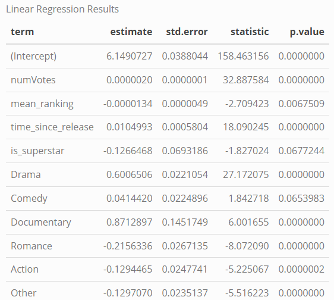
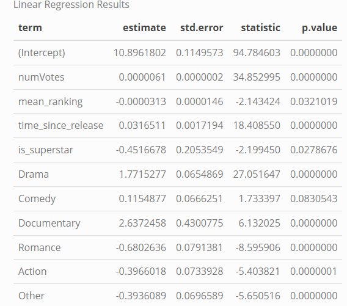
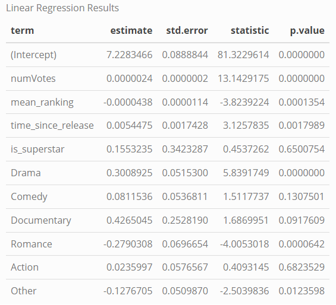

---
Contributors:
- Lex Vogels
- Floris van Berloo
- Kay van der Linden
- Thomas Gadellaa
- Mehmet Eren Erdoğan
---

# Investigating the predictors of IMDb Ratings for Movies & Series
 
## Project Description

In the current digital era of entertainment, where rating systems have a significant impact on many aspects, it is crucial to understand which factors might influence these ratings. It is clear that external factors such as viewer's satisfaction, perceived quality of the title (movie or tv series), and the place of watching the title might all affect the rating given by the viewer. However, from the perspective of creators, it might be way more interesting to look at factors that can internally be decided. What is the influence of certain actors on title ratings? Which genres tend to be rated higher? And does the consumer enjoy longer or shorter titles? 

The current research aims to deliver useful insights for content makers about which factors actually influence ratings and whether there are differences between the way in which movies are rated versus tv series. Therefore, we have formulated the following research question:

*What is the effect of title genres, actors' rating, runtime of the title, and time elapsed since release on the average rating of the title, and how does the effect depend on whether the title is a movie or a tv series?*

## Data Availability and Provenance Statements

The project benefits from open-source data that's available on https://datasets.imdbws.com. The available data is presented by IMDb, which is an organisation that is independent from the creators of the movies and tv series we are researching. Furthermore, IMDb is one of the most popular platforms for rating movies worldwide. Due to these factors, the information extracted from IMDb can be considered relatively trustworthy. Furthermore, a dataset that was previously created using information from https://www.the-numbers.com/ will be used to measure "Star power" of actors. Since this information is also available to the public, we can use it for our research. The dataset has been downloaded from a dropbox link that can be shared/used by future researchers.

### Summary of Availability

All used data sources are publicly available on *IMDb Developer* and *the-numbers* (dropbox).
Due to this, the research can easily be replicated and extended during future research projects on IMDb ratings and which variables affect a rating of a movie and/or tv series. 

### Details on each Data Source
Analysing and predicting movies & tv series ratings, we use four seperate datasets that will be prepared and merged, such that an analysis can be done on one final dataset. The four datasets are listed below, including details on which variables are visible in the dataset and which variables we believe are valuable to our research. Therefore, this also elaborates on some of the cleaning process.

1. **Title basics**
  From the Title basics dataset we use numerous columns; either as independent variable, moderator, or control variable. Firstly, *Runtime* and *Genres* will be used as two of our independent variables in our research. Additionally, *Title Type* will function as a moderator (*movies* vs. *tv series*). Finally, we are using the year the title was launched as a control variable, because, for example, titles published longer ago have generally received more reviews from so-called "laggards" (late adopters), which might result in lower average ratings than titles that have been published very recently.
2. **Title ratings**
  The Title ratings dataset forms the basis for our dependent variable *Average Rating*, while *Number of Votes* can and will be used in our analysis.
3. **Name basics**
  From the Name basics dataset we will extract which actors/actresses are linked to which movie and/or tv series titles. In this way, we can analyse the effect of these people on the rating of a title. Therefore, the actor/actress will be one of the independent variables.
4. **Star power**
  This dataset will be used to compute the average ranking of all the ranked actors in the movie/series. Additionally, we will create a dummy variable for whether actors are considered "super stars".
  
## Repository overview
```
├── README.md
├── makefile
├── .gitignore
├── data
├── gen
│   ├── analysis
│   ├── data-preparation
│   └── paper
└── src
    ├── analysis
    ├── data-preparation
    └── paper
```
## Dataset list and variable structure of final dataset

In our research, we have used the following data sets:
1. title_basics.tsv
2. title_ratings.tsv
3. name_basics.tsv
4. starPower.csv 

Prior to data cleaning, we have extensively explored the data sets. If you wish to learn more about the data sets, their variable structure, and summary statistics, please find the file here and knit the .Rmd to HTML format: src/data-preparation/r_markdown_data_acquisition.Rmd.

Listed below are all 17 variables after cleaning the datasets and running analyses

|Variable            |Description                                                       |
|--------------------|------------------------------------------------------------------|
|tconst              |Identifier variable                                               |
|averageRating       |The rating of a TV series/movie                                   |
|numvotes            |The number of votes on the rating                                 |
|titleType           |Specifies whether it is a TV series or a movie                    |
|primaryTitle        |Title of a TV series/movie                                        |
|startYear           |Year of release                                                   |
|runtimeMinutes      |Duration of a TV series/movie in minutes                          |
|genres              |All different genres of the TV series/movie                       |
|time_since_release  |Calculation of the current year (2023) - startYear                |
|Drama               |Dummy variable for the genre Drama                                |
|Comedy              |Dummy variable for the genre Comedy                               |
|Documentary         |Dummy variable for the genre Documentary                          |
|Romance             |Dummy variable for the genre Romance                              |
|Action              |Dummy variable for the genre Action                               |
|Other               |Dummy variable for the genre Other                                |
|mean_ranking        |The ranking of an actor according to IMDB data                    |
|is_superstar        |Dummy variable for superstars, according to the starPower dataset |


## Running the code
To run the code, follow these instructions:
1. Fork this repository
2. Open your command line / terminal and run the following code:
```
git clone https://github.com/{your username}/investigating_imdb_ratings
```
3. Set your working directory to `investigating_imdb_ratings` and run the following command:
```
make
```
4. In our repository, make is structured as follows:

a. Firstly, there are three makefiles. The makefile in the root repository starts data-preparation, and analysis.


b. The data-preparation makefile follows the following structure, ensuring that everything is cleaned and merged properly step-by-step:


c. Finally, analysis is done according to the structure below:


5. To clean the data of all raw and data files created during the process, run the following code in the command line / terminal: 
```
make clean
```
## Analysis

After the data set is ready for analysis, we've run linear regression analyses to evaluate the effect of actors on the `averageRating` column and the difference of contributors to the averageRating of tvSeries and movies of our data set.

#### Initial Regression Output:



-  When looking at the output, we notice that all the variables have a significant effect on the average rating except Comedy genre.

We've tried for different transformations and found that boxcox transformation is the most suitable. Here's the output of transformed variable:



-  When we read the model, the mean_ranking and is_superstar variables are in a negative relationship with the dependent variable.

-  Romance and Action genres also impact the averageRating negatively.

##### Regression Output for the Series



-  When the model for linear regression for the tvSeries is analyzed, it can be seen that is_superstar plays no significant role in the rating of the series. 

-  Drama category positively and significantly contributes to the average rating of the series. 

-  Romance is significantly correlated but in a negative direction.

For detailed information, **gen/analysis/output/linear_regression_analysis.html** file is helpful.
